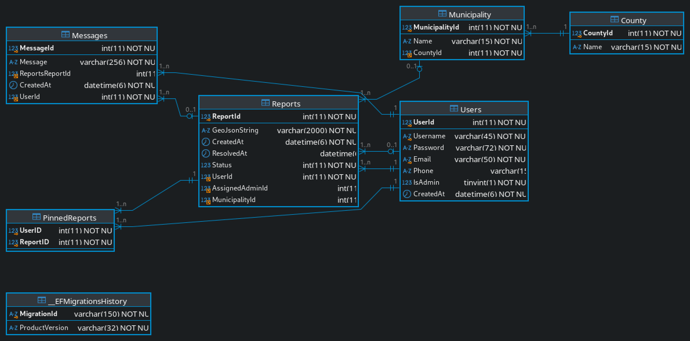

# IS202 - Kartverket rapport system
#### Gruppe 19
##### Et system for å rapportere og behandle feil ved Kartverkets kart.
___
## Systemdrift instruksjon
### Kjør i docker med docker-compose
Bruker MariaDB 11.5.2 som database og ASP.NET Core med MVC mønster i Docker med hjelp av Docker-Compose fil.

#### Start kartverket prosjekt i docker
1. Utfør i kommandolinje `docker-compose up -d` i __IS202-AspNet2308__ mappen
2. Åpne http://localhost:8080 i nettleser

##### Lage admin bruker (Valgfritt)
(Krever at Docker kontaineren er startet)
1. Utfør `docker exec -it is202-aspnet2308-db-1 mariadb -D kartverket -u kartverket -p` i kommandolinjen
2. Skriv inn `passord` når `Enter password:` etterspørres
3. I MariaDB kommandolinjen, utfør SQL spørringen 

   `INSERT IGNORE INTO Users (Username, Password, Email, IsAdmin) VALUES ("adminbruker", "$2a$12$W6x8IuTWaMclIRkcVHmo.OlP/FMK/fgzuBtqbJYNew8bQQ6o77gju", "admin@kartverket.no", TRUE);`
4. Utfør `exit;` for å gå ut av kontaineren
5. Logg inn men admin bruker på kartverket prosjektet i nettleseren
   - Brukernavn: `adminbruker`
   - Passord: `adminpassord`

## System arkitektur
Løsningen tar i bruk en moderne og skalerbar pakke med programvare som integrerer ASP.NET Core MVC med MariaDB som relasjonel database system.
Systemet følger MVC mønsteret. Mønsteret handler om Modeller, Visninger og Kontrollere som blir brukt for å skape nettsider, behandle data og styre flyten av forespørseler.
I tillegg bruker systemet Entity Framework Core for å hente og lagre data, hvor den fungerer som et Objekt-relasjonelt kartleggings verktøy (ORM). Dette simplifiserer database samhandlinger.
Endelig er det MariaDB som sørger for en robust og høyt ytende database-maskin som støtter avansert indeksing og overførings-støtte. Dette medfører rask og pålitelig data lagring.
Denne arkitekturen utnytter .NET 8 sin ytelse, kapasitet på tvers av plattformer og effektive håndtering av nettforespørsler for å levere en skalerbar, vedlikeholdbar løsning.

### Verktøy brukt i Kartverket 
* MariaDB Database v11.5.2
* ASP.NET Core MVC
* .NET 8 SDK
* Entity Framework Core v8.0.2
* Docker & Docker Compose
* Leaflet.js v1.9.2
  * Leaflet-geoman
  * Leaflet.locatecontrol
  * Leaflet-control-geocoder
* Bootstrap UI 5.2.2
* jquery v3.6.0
* popper.js v1.16.1

### Database ER diagram

